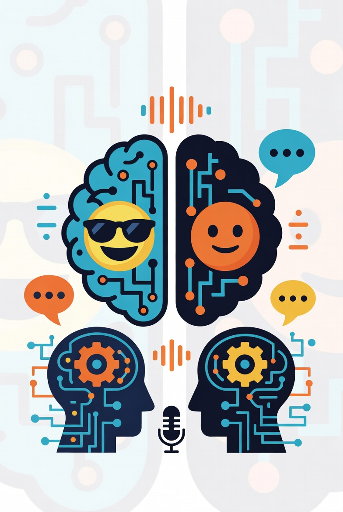

<p align="center">
  
</p>

<h1 align="center">DualMind+1 Moshi Edition</h1>

<p align="center">
  <strong>Full-duplex, sub-250ms, voice-to-voice AI conversations derived from NVIDIA's PersonaPlex.</strong><br/>
  <a href="https://github.com/dg1kjd/dualmind-plus-one">GitHub Repository</a> ·
  <a href="https://jens-david-consulting.com/dualmind/">Live Demo</a>
</p>

---

### Quick Links

- 🔗 **Repository**: [github.com/dg1kjd/dualmind-plus-one](https://github.com/dg1kjd/dualmind-plus-one)
- 🚀 **Live Demo**: [https://jens-david-consulting.com/dualmind/](https://jens-david-consulting.com/dualmind/)

---

## Contents

1. [Overview](#overview)
2. [System Components](#system-components)
3. [Requirements](#requirements)
4. [Installation](#installation)
5. [Running the System](#running-the-system)
6. [Credits / License / Authors](#credits--license--copyright--authors)
7. [Disclaimer](#disclaimer)
8. [Acknowledgments](#acknowledgments)

---

## Overview

**DualMind+1 Moshi Edition** is a full-duplex, voice-to-voice conversational system derived from NVIDIA's PersonaPlex (itself based on Kyutai's Moshi). Two PersonaPlex instances run in parallel, speaking with each other and—if you want— with the user. The demo highlights what low-latency audio LLMs can currently do: sub-250 ms response times, barge-ins, back-channeling ("right", "sure", "mhm"), spontaneous exclamations, and messy human fillers like "umm" or laughter.

You can tailor each AI party with a system-style prompt and choose from several native or accented voices. Disabling the second participant turns the experience into a PersonaPlex-like single-agent conversation. A headset is optional thanks to echo cancellation and the model's inherent echo resistance. English is the only supported language. This is an entertainment-focused conversational showcase, not a research assistant, and it cannot be "patched" with a text LLM because the entire stack operates on audio streams.

The platform is split between a Python conference server that mixes audio, runs the Moshi+Mimi inference stack, and serves static assets, plus a lightweight web client that captures microphone audio, streams Opus-compressed frames, and renders the conference UI.

## System Components

- **Conference Server**: Async Python service (`moshi.conference`) that mixes audio, coordinates persona prompts, streams Moshi+Mimi inference on CUDA devices, and serves the static UI over HTTPS/WebSocket.
- **Client Frontend / UI**: React-based UI responsible for microphone capture, speaker playback, and WebSocket transport using WASM helpers and Opus compression to minimize bandwidth.
- **Moshi**: Core inference engine for audio generation, derived from Kyutai's models and running NVIDIA PersonaPlex weights with performance tweaks for Blackwell GPUs.
- **Mimi**: Neural audio codec using Residual Vector Quantization (RVQ) so model I/O stays compact instead of tokenized text.
- **Weights**: Pre-trained PersonaPlex weights distributed under the NVIDIA Open Model License. They are fetched from Hugging Face on first run rather than shipped in this repo.

## Requirements

- **Hardware**: Recommended 2 CUDA devices, minimum 2x RTX 3090. Tested on 1x RTX 3090 and 1x RTX 5090. VRAM consumption: ~19.5GB per GPU. Two RTX 3090s should be just fine as well. Alternatively data center-grade compute (i.e. A100/H100). The system runs one moshi instance per GPU together with its respective mimi codecs. CPU is not used heavily, only for mixing and simple SRC.
- **Software**: Tested with Python 3.11.12, Pytorch nightly (torch-2.11.0.dev20260117+cu128), CUDA 12.8, Transformers 4.57.3. Confer requirements.txt for rough guidance. *(Optional)* Install `accelerate` if you plan to use the new CPU offload mode: `pip install accelerate`.
- **Power Consumption**: About 240W for RTX 3090, 190W for RTX 5090 (continuous during conversation)
- **Hugging Face account** for downloading weights.
- **Network**: Should be as low-latency as possible, audio buffering is set to 80ms. LAN/localhost connection recommended.
- **Audio**: Microphone/Speaker combo, headset optional.
- **Recent Browser**: Recent Chrome, Firefox, Safari, iPhone Safari. Edge, Android not tested. Uses no WebRTC.
- **Optional SSL Certs**: If non-local usage is desired, SSL certificates are required because browser will refuse audio input/output if the connection is not secure.
- **Optional Inbound Proxy**: If non-local usage is desired, an inbound proxy is recommended for security and sanitization. Recent Apache with mod_proxy and mod_proxy_wstunnel is sufficient and proved performant for single user inference.

## Installation

This is an experimental system, these are only approximate instructions. You should know what you are doing w/r/t Pytorch dependencies and CUDA.

1. Clone the repository:
   ```bash
   git clone https://github.com/dg1kjd/dualmind-plus-one.git
   cd dualmind-plus-one
   ```
2. Set up a virtual environment for all backend components:
   ```bash
   python3 -m venv .venv
   source .venv/bin/activate
   ```
3. Install a CUDA 12.8+/sm_120 capable PyTorch nightly build (required for RTX 5090 / Blackwell class GPUs). If you run older GPUs you may choose a different wheel, but the nightly ensures kernels exist for the latest architectures:
   ```bash
   pip install --pre torch torchvision torchaudio --index-url https://download.pytorch.org/whl/nightly/cu128
   ```
4. Install the remaining backend dependencies (this also installs the local `moshi` package via the editable requirement):
   ```bash
   pip install -r requirements.txt
   ```
5. Build the React client (note the `client/` subfolder):
   ```bash
   cd client
   npm install
   npm run build
   ```
   The build artifacts will be emitted to `client/dist/`; the server can also serve the checked-in `conference_ui` folder.
6. Generate self-signed SSL certificate (if needed). **Note: SSL required for audio to work**
   ```bash
   apt-get update && apt-get install -y openssl
   openssl req -x509 -nodes -days 365 -newkey rsa:2048 \
    -keyout key.pem -out cert.pem \
    -subj "/C=US/ST=State/L=City/O=Organization/CN=localhost"
   ```

Tested on heavily modified Ubuntu 24.04.6 LTS with CUDA 12.8 and Consumer Blackwell & Ampere.

## Running the System

To start the DualMind+1 conference system, use the following command:
```bash
source .venv/bin/activate && \
PYTORCH_CUDA_ALLOC_CONF=expandable_segments:True,max_split_size_mb:256 \
PYTHONUNBUFFERED=1 python -m moshi.conference \
  --device-a cuda:0 --device-b cuda:1 \
  --static conference_ui --port 8999
```
Will run locally, point web browser to https://localhost:8999 . ***The "S" is important because most web browsers will refuse to access the microphone if the connection is not secure.***

Or, if running publicly with inbound proxy:
```bash
source .venv/bin/activate && PYTHONUNBUFFERED=1 python -m moshi.conference --device-a cuda:0 --device-b cuda:1 --static conference_ui --port 8999 --allowed-origin https://www.your-origin-here.com
```

- `--device-a` and `--device-b`: Specify the CUDA devices for model inference (e.g., `cuda:0` and `cuda:1`).
- `--static`: Points to the directory containing static files for the conference UI.
- `--port`: The port on which the server will run (default: 8999).
- `--cpu-offload`: Optional flag that keeps most of the LM on GPU but spills excess layers to CPU/disk using Hugging Face Accelerate (install with `pip install accelerate`). Useful if your GPU VRAM is under ~20 GB.

### CPU Offload (Optional)

Both the WebSocket server (`python -m moshi.server`) and offline tool (`python -m moshi.offline`) accept `--cpu-offload`. When present we use Accelerate’s device map support to keep attention blocks on CUDA while offloading remaining layers to CPU, enabling PersonaPlex inference on cards with less VRAM.

Example:

```bash
python -m moshi.server --device cuda:0 --cpu-offload --static conference_ui --port 8998
```

## Credits / License / Copyright / Authors

**This is a derivative work of NVIDIA's PersonaPlex system and -model and Kyutai's Moshi**. For original documentation and details, refer to `README_nv.md` and Moshi docs in this repository. Their respective licenses and copyrights apply.

This project is released under the MIT License. See `LICENSE-MIT` for details. Note that model weights are under the NVIDIA Open Model License, as described in `README_nv.md`.

**Copyright 2026 Jens David Consulting (derivative work only)**
**Authors**: David, Jens (JDC) <dm2026@jens-david-consulting.com> @dg1kjd on X // Opus-4.5, Claude (Anthropic)
**Original Authors**: NVIDIA, Kyutai, see respective docs

## Disclaimer

**IMPORTANT DISCLAIMER**: This software and all associated materials are provided "AS IS" and "WITH ALL FAULTS," without any warranties or conditions of any kind, whether express, implied, or statutory, including but not limited to warranties of merchantability, fitness for a particular purpose, title, non-infringement, or any other warranty. The entire risk as to the quality and performance of the software is with you. In no event shall the authors, contributors, or copyright holders be liable for any claim, damages, or other liability, whether in an action of contract, tort, or otherwise, arising from, out of, or in connection with the software or the use or other dealings in the software. Use at your own risk. This project is a derivative work and does not imply endorsement by NVIDIA or any other original contributors.
DO NOT USE IT FOR BAD STUFF PLEASE.

## Acknowledgments

- Original codebase derived from NVIDIA's PersonaPlex. Model: NVIDIA
- `moshi` inference code adapted from Kyutai
- mimi codec: Kyutai